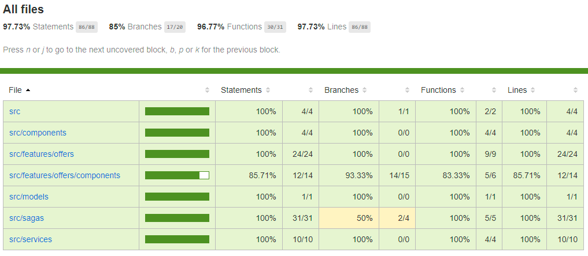
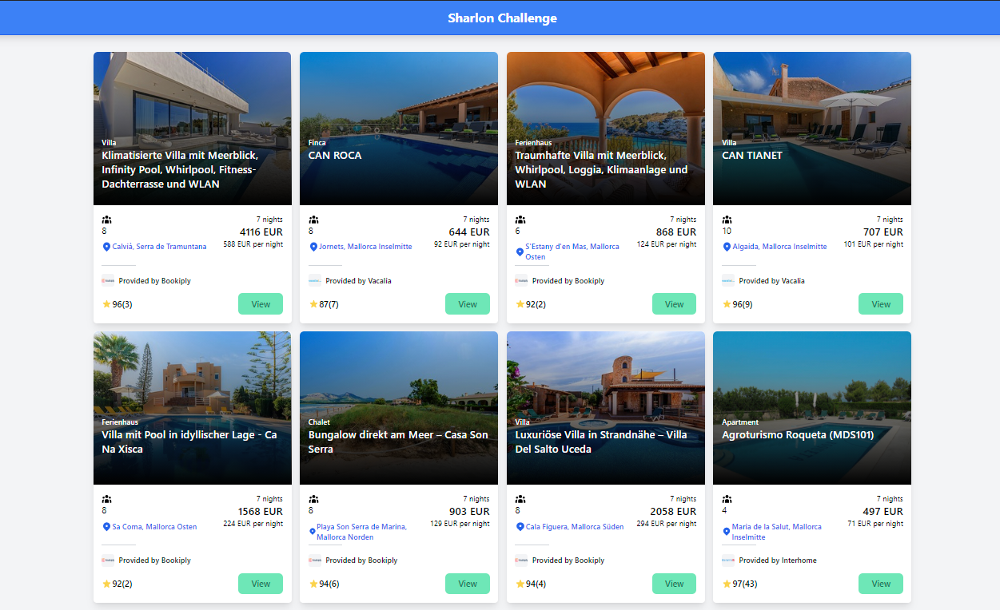

# Vacation Offers Application

### Hi!

This is example application that uses Redux Toolkit, Redux Saga for fetching data from an endpoint it also includes unit and integration test.

## Test coverage



## Screenshot




### Instructions on how to run
* yarn install
* yarn start

### Implemented functionality

* Fetch offers using the endpoint provided.
* Use Redux Saga and immutable data store courtesy of Redux PLEASE SEE NOTE BELOW.
* Pagination using cursor provided by the endpoint.
* Integration Test see features/offers/components/Offers.int.test.tsx
* Unit Test Included

### Folder structure

* src/components - generic components
* src/features - components connected with redux and reducer
* src/services - backend api
* src/models - pure function for data transformations
* src/sagas - redux saga

### Technology stack used

* TypeScript (I love working with TS)
* @redux/toolkit for opinionated redux setup
* Redux Saga
* Jest and React Testing Library for Unit and Integration Test

# BIG NOTE!!!

I am using redux toolkit it uses [immerjs](https://immerjs.github.io/immer/docs/introduction) behind the scene that enables developer to write mutation operations that are translated to immutable operation

```ts
// This is immutable operation behind the scene courtesy of immerjs
toggleIsLoading: (state) => {
      state.isLoading = !state.isLoading;
    },
```


I would love to have your feedback regarding the application. If you have question or if for some reason the app doesn't run please let me know. (sbalbalosa@gmail.com)

Thanks,
Sharlon Balbalosa
